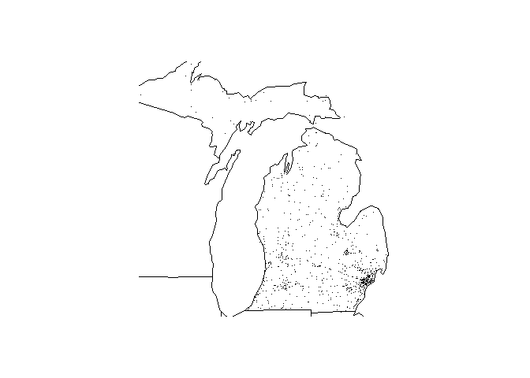

<!-- README.md is generated from README.Rmd. Please edit that file -->
FARS
====

The goal of FARS is to provide functions that work with data from the US National Highway Traffic Safety Administration's Fatality Analysis Reporting System (F.A.R.S.), which is a nationwide census providing the American public yearly data regarding fatal injuries suffered in motor vehicle traffic crashes.

fars\_read function
-------------------

This function allows to read a compressed (.bz2) or a csv file. It counts with only one argument "filename" which is a caracter that contains the name of the file with its respective extension. This function returns the read data in a "dataframe", "tbl\_df", "tbl" format. And it will generate an error if the filemane is wrong or have a wrong extension.

``` r
fars_read(make_filename(2013))
#> # A tibble: 30,202 x 50
#>    STATE ST_CASE VE_TOTAL VE_FORMS PVH_INVL  PEDS PERNOTMVIT PERMVIT
#>    <int>   <int>    <int>    <int>    <int> <int>      <int>   <int>
#>  1     1   10001        1        1        0     0          0       8
#>  2     1   10002        2        2        0     0          0       2
#>  3     1   10003        1        1        0     0          0       1
#>  4     1   10004        1        1        0     0          0       3
#>  5     1   10005        2        2        0     0          0       3
#>  6     1   10006        2        2        0     0          0       3
#>  7     1   10007        1        1        0     0          0       1
#>  8     1   10008        2        2        0     0          0       2
#>  9     1   10009        1        1        0     0          0       1
#> 10     1   10010        2        2        0     0          0       4
#> # ... with 30,192 more rows, and 42 more variables: PERSONS <int>,
#> #   COUNTY <int>, CITY <int>, DAY <int>, MONTH <int>, YEAR <int>,
#> #   DAY_WEEK <int>, HOUR <int>, MINUTE <int>, NHS <int>, ROAD_FNC <int>,
#> #   ROUTE <int>, TWAY_ID <chr>, TWAY_ID2 <chr>, MILEPT <int>,
#> #   LATITUDE <dbl>, LONGITUD <dbl>, SP_JUR <int>, HARM_EV <int>,
#> #   MAN_COLL <int>, RELJCT1 <int>, RELJCT2 <int>, TYP_INT <int>,
#> #   WRK_ZONE <int>, REL_ROAD <int>, LGT_COND <int>, WEATHER1 <int>,
#> #   WEATHER2 <int>, WEATHER <int>, SCH_BUS <int>, RAIL <chr>,
#> #   NOT_HOUR <int>, NOT_MIN <int>, ARR_HOUR <int>, ARR_MIN <int>,
#> #   HOSP_HR <int>, HOSP_MN <int>, CF1 <int>, CF2 <int>, CF3 <int>,
#> #   FATALS <int>, DRUNK_DR <int>
```

make\_filename function
-----------------------

This function allows to create a character with a filename, that will have a "csv.bz2" extension. The filename will always be "accident\_*.csv.bz2", with the only diference that "*" will be replace by the entered year. This function has only one parameter named "year" an integer that represent a year.This function will return a caracter with a filename. It will generate an warning message if the parameter "year" is a character instead a integer.

``` r
make_filename(2013)
#> [1] "C:/Users/Freddy Tapia/Documents/R/win-library/3.5/FRED/extdata/accident_2013.csv.bz2"
```

fars\_read\_years function
--------------------------

This function allows to select the variable "MONTH" and "YEAR" from the data for the accidents that happend in the year or years entered. The argument of the function is "years" an integer that represent a year or years. This function will return a list with the variable "MONTH" and "YEAR" for the year or years entered. It will generate an warning message if the year or years entered does not exists in the database.

``` r
fars_read_years(c(2013,2014))
#> [[1]]
#> # A tibble: 30,202 x 2
#>    MONTH  year
#>    <int> <int>
#>  1     1  2013
#>  2     1  2013
#>  3     1  2013
#>  4     1  2013
#>  5     1  2013
#>  6     1  2013
#>  7     1  2013
#>  8     1  2013
#>  9     1  2013
#> 10     1  2013
#> # ... with 30,192 more rows
#> 
#> [[2]]
#> # A tibble: 30,056 x 2
#>    MONTH  year
#>    <int> <int>
#>  1     1  2014
#>  2     1  2014
#>  3     1  2014
#>  4     1  2014
#>  5     1  2014
#>  6     1  2014
#>  7     1  2014
#>  8     1  2014
#>  9     1  2014
#> 10     1  2014
#> # ... with 30,046 more rows
fars_read_years(2013)
#> [[1]]
#> # A tibble: 30,202 x 2
#>    MONTH  year
#>    <int> <int>
#>  1     1  2013
#>  2     1  2013
#>  3     1  2013
#>  4     1  2013
#>  5     1  2013
#>  6     1  2013
#>  7     1  2013
#>  8     1  2013
#>  9     1  2013
#> 10     1  2013
#> # ... with 30,192 more rows
```

fars\_summarize\_years function
-------------------------------

This function allows to generate a summary of the accidents that happend in a specific year or years. The parameter "years" is an integer that represent a year or years. This function will return a summary for every month of every year in a "dataframe", "tbl\_df", "tbl" format. It will generate an warning message if the year or years entered does not exists in the database.

``` r
fars_summarize_years(c(2013,2014))
#> # A tibble: 12 x 3
#>    MONTH `2013` `2014`
#>    <int>  <int>  <int>
#>  1     1   2230   2168
#>  2     2   1952   1893
#>  3     3   2356   2245
#>  4     4   2300   2308
#>  5     5   2532   2596
#>  6     6   2692   2583
#>  7     7   2660   2696
#>  8     8   2899   2800
#>  9     9   2741   2618
#> 10    10   2768   2831
#> 11    11   2615   2714
#> 12    12   2457   2604
fars_summarize_years(c(2013,2015))
#> # A tibble: 12 x 3
#>    MONTH `2013` `2015`
#>    <int>  <int>  <int>
#>  1     1   2230   2368
#>  2     2   1952   1968
#>  3     3   2356   2385
#>  4     4   2300   2430
#>  5     5   2532   2847
#>  6     6   2692   2765
#>  7     7   2660   2998
#>  8     8   2899   3016
#>  9     9   2741   2865
#> 10    10   2768   3019
#> 11    11   2615   2724
#> 12    12   2457   2781
```

fars\_map\_state function
-------------------------

This function will allow to plot the longitude and latitude of the accidents that happend in a specific state in a specific year. This function counts with two parameters "state.num" and "year", the first ones indicates an integer that represent the number of a state, and the second one is an integer that represent a year. This function returns a graph where can be seen the location (latitude and longitude) of the accident that happend in the state in the year entered. It will generate an error if the year or state does not exists in the database.

``` r
fars_map_state(26,2013)
#> Warning: package 'bindrcpp' was built under R version 3.5.1
```


